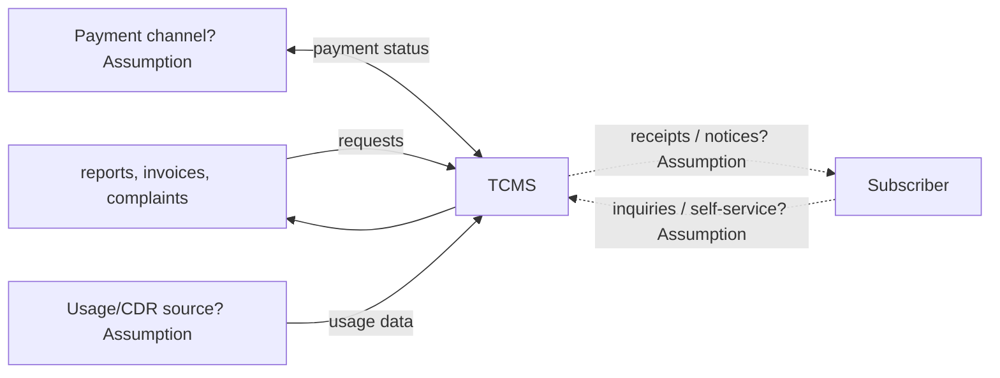
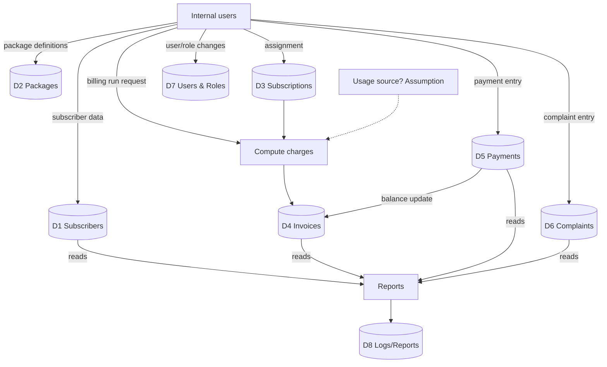

# data-flow.md — TCMS Data Flow

Status: **Initial Draft.** Diagrams are Level-0/Level-1 conceptual data flows (DFD style),
**not** a database schema. No tables, columns, or storage technology are decided.

Revised after Phase 2/3 once use cases and flows are confirmed.

---

## 1. External entities (Draft)

| ID | External entity | Notes |
|---|---|---|
| E-1 | Sales Agent / Customer Service / Billing / Administrator (internal users) | Actors of the system |
| E-2 | Subscriber (end customer) | Assumption — self-service scope unknown (OQ-04) |
| E-3 | Payment channel / bank | Assumption — external payment integration unconfirmed |
| E-4 | Usage/CDR source | Assumption — only if billing is usage-based (OQ-08) |

---

## 2. Main data stores (Draft — conceptual, not schema)

| DS | Data store | Contents (conceptual) |
|---|---|---|
| D1 | Subscribers | subscriber master data, status |
| D2 | Packages/Offers | plans, prices, conditions |
| D3 | Subscriptions | subscriber ↔ package assignments |
| D4 | Invoices | invoices, lines, balances |
| D5 | Payments | payment records, reconciliation |
| D6 | Complaints | complaints, notes, status |
| D7 | Users & Roles | accounts, roles, permissions |
| D8 | Logs/Reports | audit & report outputs (Assumption) |

---

## 3. Context diagram (Level 0, Draft)

---

## 4. Level-1 data flows (Draft)

---

## 5. Main data entities (Draft, conceptual)

| Entity | Key attributes (conceptual only) | Relations (conceptual) |
|---|---|---|
| Subscriber | identity, contact, status | has 1..n Subscriptions; 0..n Invoices; 0..n Complaints |
| Package | name, price, conditions | assigned via Subscription |
| Subscription | start/end, status | links Subscriber ↔ Package |
| Invoice | period, amount, status | belongs to Subscriber; 0..n Payments |
| Payment | amount, date, method | settles Invoice |
| Complaint | type, description, status | belongs to Subscriber |
| User / Role | account, role | performs operations; audit logged |

**No schema is defined here.** Database design is Phase 6 territory and blocked by the
Phase 1–5 gate.

---

## 6. Open questions

- Is billing usage-based (CDR), flat-rate, or hybrid? (OQ-08)
- Are payments integrated with an external channel or recorded manually? (Assumption: manual for now)
- Which data must be retained for audit/regulatory purposes? (unknown — needs doctor input)
- Personal-data handling rules (privacy) — unknown.
