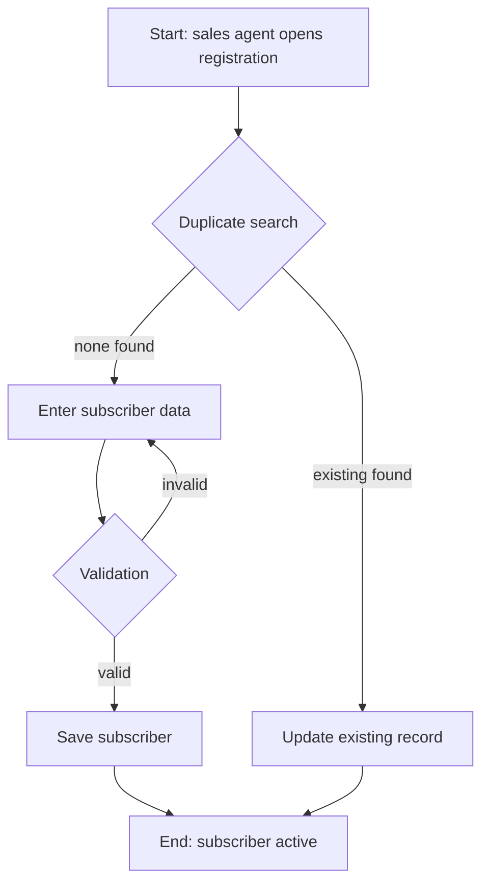
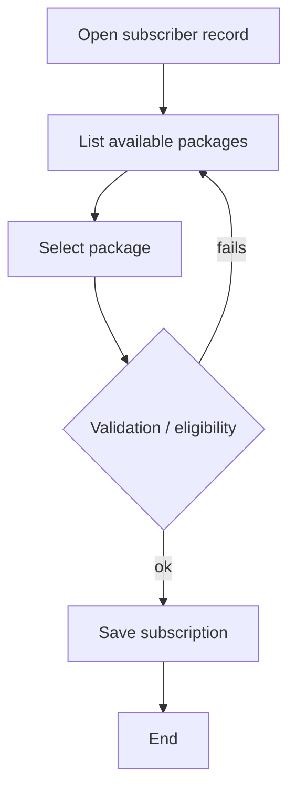
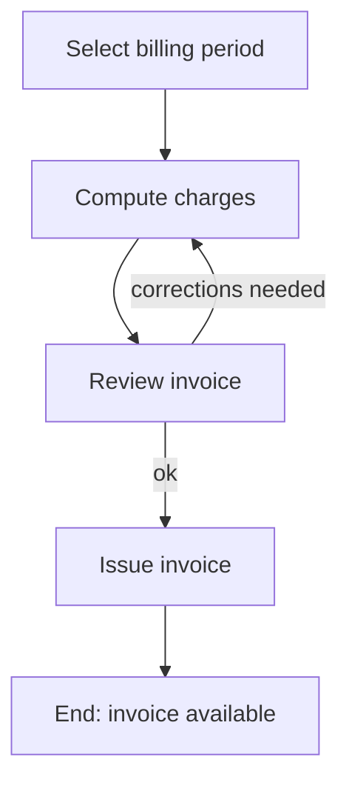
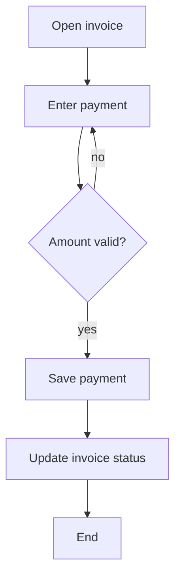
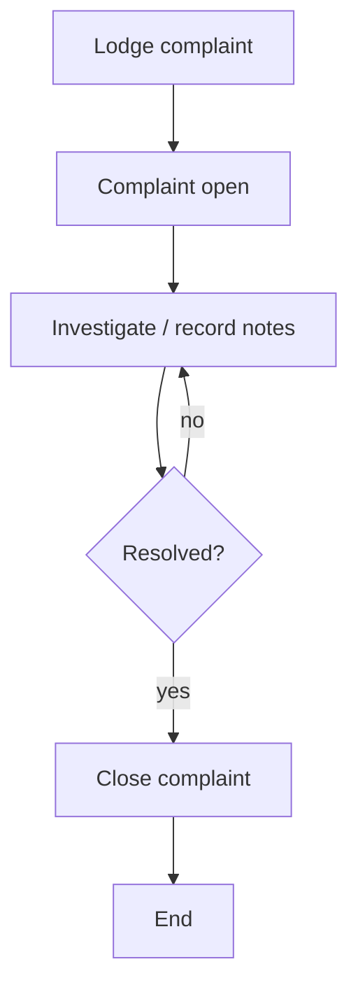
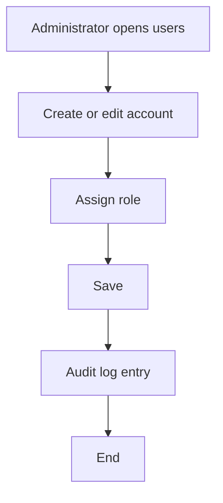

# flow-of-action.md — TCMS Flow of Action

Status: **Initial Draft.** Explicitly provisional: these flows are re-derived after the
use cases are fixed in Phase 2 (`use-case-scenario.md`, `use-case-action.md`).

Scope: a representative flow per main operation. Not exhaustive.

---

## 1. Flow of action — Subscriber registration (UC-01, Draft)

---

## 2. Flow of action — Package assignment (UC-02, Draft)

---

## 3. Flow of action — Invoice generation (UC-03, Draft)

Open: automatic vs manual trigger (OQ-08).

---

## 4. Flow of action — Payment recording (UC-04, Draft)

---

## 5. Flow of action — Complaint handling (UC-05/UC-06, Draft)

---

## 6. Flow of action — User & role management (UC-08, Draft)

---

## 7. Revision note

- All flows assume a web application with server-side validation — this is an
  **Assumption**, not a decided architecture (see `docs/architecture.md`).
- Flows will be reviewed against Phase 2 use cases and against the doctor's flow
  requirements (there may be a prescribed flow format — Open Question OQ-01).
