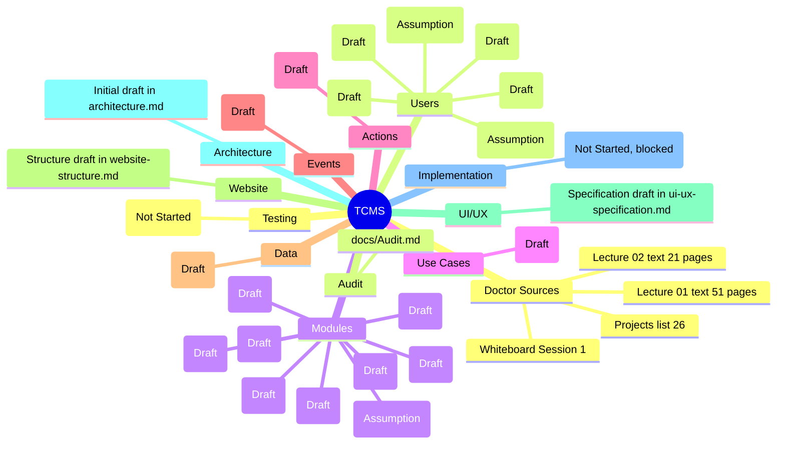

# mindmap.md — TCMS Project Mind Map

Status: **Initial Draft** — every node below is unconfirmed until the doctor's
requirements are read. Nodes are marked with their confidence level:
`(Confirmed)` · `(Draft)` · `(Assumption)` · `(?) Open Question`.

---

## Master map



---

## Text form (same content)

```
TCMS — Telecom Management System
│
├── Doctor Sources (docs/doctor-sources/ — verified, OQ-01 Resolved)
│   ├── Lecture 01 — text, 51 pages (lecture-01-text.md)
│   ├── Lecture 02 — text, 21 pages (lecture-02-text.md + summary)
│   ├── Projects list — 26 projects, TCMS = #16 (projects/projects-list.txt)
│   └── Whiteboard — Session 1 (whiteboard/whiteboard-notes.md)
│
├── Users (Draft)
│   ├── Administrator
│   ├── Customer Service
│   ├── Billing / Finance
│   ├── Sales
│   ├── Subscriber            (Assumption)
│   └── Technician / Field    (Assumption)
│
├── Modules (Draft)
│   ├── Subscriber Management
│   ├── Packages / Offers
│   ├── Billing & Invoicing
│   ├── Payments
│   ├── Complaints & Support
│   ├── Sales / Orders
│   ├── Inventory (SIM & Devices)   (Assumption)
│   ├── Reporting & Dashboards
│   └── Administration & Roles
│
├── Use Cases  → docs/use-case-scenario.md  (Initial Draft)
├── Actions    → docs/use-case-action.md    (Initial Draft)
├── Events     → docs/flow-of-event.md      (Initial Draft)
├── Data       → docs/data-flow.md          (Initial Draft)
├── Website    → docs/website-structure.md  (Initial Structure)
├── UI/UX      → docs/ui-ux-specification.md (Initial Specification)
├── Architecture → docs/architecture.md     (Architecture Initial Draft)
│
├── Implementation (Phase 6 — Not Started, blocked by Phase 1–5 gate)
├── Testing (Phase 7 — Not Started)
└── Audit → docs/Audit.md
```

---

## Notes

- The map is required by the project brief (`mindmap.md`).
- The exact node structure must be revised if the doctor's sources define a different
  decomposition (Open Question OQ-01 / OQ-02).
- No node here is a Confirmed Requirement.
